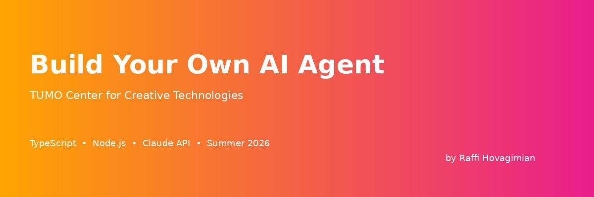

# TUMO - Build Your Own AI Agent Workshop

###### Agenda

**Week 1 — Learn the building blocks**
1. [What Are AI Agents?](./day-01/)
2. [Talking to an LLM Programmatically](./day-02/)
3. [Tools: Giving Your Agent Hands](./day-03/)
4. [The Agent Loop in Code](./day-04/)
5. [Memory, Context & Planning](./day-05/)

[Google Slides](https://drive.google.com/drive/folders/1Bh2cmQfCu4d_xRiwvI00oa9GU33BVIyR?usp=drive_link)

**Week 2 — Build your own** *(no starter code — you fork the Day 5 agent and make it yours)*
6. Project Kickoff & Design
7. Build Sprint 1
8. Build Sprint 2
9. Polish & Prepare
10. Demo Day

## What You'll Build

By the end of Week 1 you'll have a **complete, working AI agent** backed by Claude —
one that uses tools, runs an agent loop, plans its steps, and remembers across sessions.
In Week 2 you fork that template and make it your own.

## How This Repo Works

- **`day-01/` … `day-05/`** — **starter code**: skeletons with `TODO` comments.
  This is where you write code *during* each lesson. Each day folder is self-contained.
- **`solutions/`** — the **complete, finished code** for every day.

#### Missed a day? Here's how to catch up

1. Open [`solutions/`](./solutions/) for the day you missed and read the finished code.
2. Come to the new day and start fresh from that day's starter folder.

Each day's starter stands on its own, so you never need the previous day's work to begin.
If you ever get stuck on a `TODO`, peek at the matching file in `solutions/`.

## The Agent Recipe

Every agent you build = four ingredients:
1. **Tools** — functions Claude can request
2. **Loop** — call Claude, run tools, repeat until done
3. **Prompt** — plan + personality + rules
4. **Memory** — remember what matters

## Prerequisites

- TUMO Programming Level 2 (required), Level 3 (preferred)
- Node.js 18+ installed
- A code editor (VS Code recommended)

## Quick Start

```bash
# Clone this repo
git clone https://github.com/rhovagimian/tumo-ai-agents.git
cd tumo-ai-agents

# Go to the day's STARTER folder
cd day-01

# Install dependencies
npm install

# Set your API key — copy the example file and paste your key into .env
cp .env.example .env
# (or export it directly: export ANTHROPIC_API_KEY="your-key-here")

# Fill in the TODOs, then run a script
npx tsx src/01-hello-claude.ts
```

## Workshop Leader

**Raffi Hovagimian** — Software Engineer at Meta
